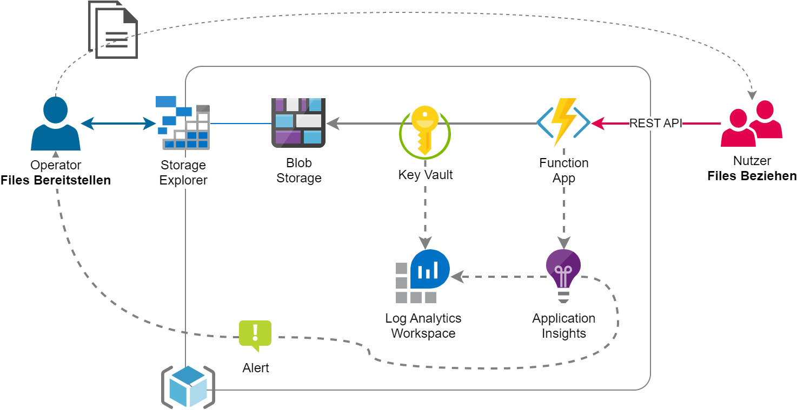
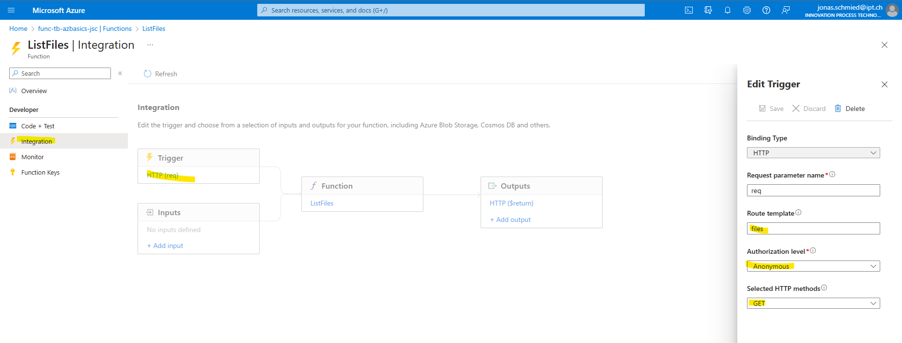
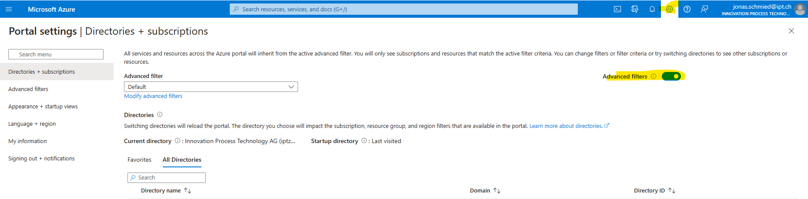
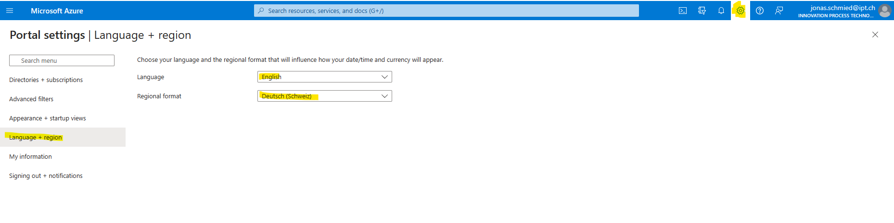

# Hands-on Challenge
Dein Kunde möchte eine REST API zum Anzeigen und Downloaden von manuell bereitgestellten Files anbieten können. Die User Story hat folgende Akzeptanzkriterien definiert:

- Die Route GET `/files` listet alle verfügbaren Dateien inklusive einem Download-Link der Datei
- Der Download-Link ist jeweils nur für 5 Minuten gültig
- Die API Requests können einfach statistisch ausgewertet werden, d.h. wieviele Anfragen in welchem Zeitraum getätigt werden
- Die Implementation erfolgt nach den Zero Trust Prinzipen, verzichtet aber im ersten Ausarbeitungsschritt auf Netzwerksicherheit und User-Authentifikation

Stretch Goals (optional):
- Auftrennung der Logik in ein echtes REST API Pattern wie folgt:
  - Die Route GET `/files` listet alle verfügbaren Dateien auf (nur Namen)
  - Die Route GET `/files/{filename}` liefert Detaileigenschaften sowie einen Download-Link der Datei
- Wenn mehr als 5 Detailabfragen pro Stunde erfolgen, erfolgt eine Benachrichtigung per Email (für Entwicklung kann diese frei gewählt werden)

Du bist beauftragt, möglichst schnell und einfach einen Proof of Concept zu realisieren. In einem früheren Backlog Refinement wurde von einem Architekten folgende Skizze erstellt:



# Guide
Diese Challenge ist nicht als Copy-Paste Tutorial konzipiert. Sie kann ganz verschieden gelöst werden. Nachfolgend ist ein möglicher Lösungsweg grob skizziert:

1. Resource Group erstellen

   Tipp Naming: https://learn.microsoft.com/en-us/azure/cloud-adoption-framework/ready/azure-best-practices/resource-naming

1. Log Analytics Workspace erstellen

1. Application Insights erstellen und Workspace referenzieren

1. Storage Account erstellen

    - Hinweis: Standard/LRS ist ausreichend

1. Function App erstellen und Application Insights / Storage Account referenzieren

    - Consumption Plan
    - Runtime Stack je nach gewünschter Code Language: https://learn.microsoft.com/en-us/azure/azure-functions/supported-languages#language-support-details
    - Hinweis: In-Portal Editing in obenstehend referenzierter Tabelle bedeutet, dass direkt im Portal ohne weitere Tools programmiert werden kann. Je nach Vorkenntnissen könnte dies der schnellste Weg sein...

1. Auf Function App die (System-assigned) Managed Identity aktivieren

1. Key Vault erstellen

   - Hinweis: Standard ist ausreichen und Purge Protection wird in diesem Use Case nicht benötigt
   - Access Policy für Function App erstellen: Permission `Secret/Get`
   - Access Policy für aktuellen User erstellen (bzw. editieren): Permissions `Secret/*`

1. Connection zu Storage Account in Function App konfigurieren

   - Wurde die Function App nicht schon beim Deployment mit dem Storage Account verknüpft? Stimmt, eine Function App im Consumption & Premium Plan erfordert zwingend einen Storage Account, so dass bei Skalierungsoperationen und im Standby der Memory Stack persistiert werden kann. Generell wird [nicht empfohlen, den gleichen Storage Account auch für andere (fachliche) Zwecke](https://learn.microsoft.com/en-us/azure/azure-functions/storage-considerations) zu nutzen. Daran muss man sich nicht immer halten, jedoch sollte zumindest immer eine eigene Konfiguration verwendet werden, so dass Anpassungen in späteren Phasen einfach vollziehbar sind.
   - Tipp "Best Practices Lösung": https://learn.microsoft.com/en-us/azure/app-service/app-service-key-vault-references
     - Secret im Key Vault mit Connection String anlegen (Speichern nicht vergessen)
     - Application Settings Konfiguration als Key Vault Referenz in der Function App erstellen
     - Falls ein grünes Check-Icon in der Source Column erscheint, dann klappt die Verbindung (Wieso eigentlich? Was passiert wenn der Konfigurationswert ändert?)

1. Ein paar beliebige Files in einen Blob Container (Storage Account) hochladen

   - Tipp: Der [Azure Storage Explorer](https://azure.microsoft.com/en-us/products/storage/storage-explorer) ist in vereinfachter Form direkt im Portal verfügbar (Bereich `Storage browser` in der Storage Account Resource). Alternativ kann auch z.B. die Visual Studio Code Extension verwendet werden.

1. Function für Files Listing erstellen

   - Getting Started: https://learn.microsoft.com/en-us/azure/azure-functions/functions-reference
   - Hinweis: Der App Service Editor bietet erweiterte Funktionalitäten, falls du dich für eine Programmierung direkt im Portal entscheidest

## Zusätzliche Schritte für Strech Goals

1. Function für File Details inkl. Download Link erstellen

1. Monitoring Metriken hinzufügen

   - Hinweis: Das ist optional, es könnte auch mit den Standardmetriken gearbeitet werden

1. Metriken in Application Insights analysieren und Alert Rule erstellen

## Zusatzinfos

a) Ja, man kann auch direkt mit der Function starten und die Resourcen implizit generieren lassen

b) Natürlich könnt ihr auch die Managed Identity der Function direkt für den Storage Account berechtigen. Wäre insgesamt schlanker und naheliegender. Diesen Umweg zeigen wir, um beide Möglichkeiten zu demonstrieren und den Key Vault Service sinnvoll einzuführen.

# Fast Track

## IaC Deployment
Wir empfehlen erste Schritte manuell im Azure Portal auszuführen. So wird man mit den Strukturen vertraut und bekommt Routine mit der teils gewöhnungsbedürftigen Navigation (dafür ist man beispielweise in Debugging Situationen froh). Wenn man Services manuell und step-by-step deployed, lassen sich Abhängigkeiten, Relationen und Sub-Komponenten leicht erkennen. Infrastructure as Code und Deployment Automatisierung ist gut und wichtig - aber man sollte verstehen was man dabei macht.

Wer soweit ist, und sich nur um den Code-Teil kümmern möchte, hier die Überholspur:

[](https://portal.azure.com/#create/Microsoft.Template/uri/https%3A%2F%2Fraw.githubusercontent.com%2Fiptch%2F2023-05-techbier-azure-basics%2Fmain%2Fdeployment%2Fazuredeploy.json)

## Business Logik
Stimmt, es geht um die Azure Cloud, nicht ums Programmieren. Wir habens uns einfach gemacht und mit [C# Script (der kleine Bruder von C#.NET) gearbeitet](https://learn.microsoft.com/en-us/azure/azure-functions/functions-reference-csharp).

Hier die Überholspur dazu:

**Bei allen Functions im App Service Editor ein neues File `function.proj` erstellen**
```xml
<Project Sdk="Microsoft.NET.Sdk">
  <PropertyGroup>
    <TargetFramework>netstandard2.0</TargetFramework>
  </PropertyGroup>

  <ItemGroup>
    <PackageReference Include="Azure.Storage.Blobs" Version="12.15.1"/>
    <PackageReference Include="Newtonsoft.Json" Version="13.0.3"/>
  </ItemGroup>
</Project>
```

**ListFiles (komplett): `run.csx`**
```csharp
using System.Net;
using System.Collections.Generic;
using Microsoft.AspNetCore.Mvc;
using Microsoft.Extensions.Primitives;
using Newtonsoft.Json;
using Newtonsoft.Json.Serialization;
using Azure.Storage.Blobs;
using Azure.Storage.Blobs.Models;
using Azure.Storage.Sas;

public static async Task<IActionResult> Run(HttpRequest req, ILogger log)
{
    log.LogInformation($"Get files triggered");

    string storageConnectionString = System.Environment.GetEnvironmentVariable("StorageConnectionString", EnvironmentVariableTarget.Process);
    string storageBlobContainer = System.Environment.GetEnvironmentVariable("StorageBlobContainer", EnvironmentVariableTarget.Process);

    var blobContainer = new BlobContainerClient(storageConnectionString, storageBlobContainer);

    if (!await blobContainer.ExistsAsync())
    {
        return new NoContentResult();
    }

    if (!blobContainer.CanGenerateSasUri)
    {
        return new UnauthorizedResult();
    }

    var results = new List<FileInfo>();

    // List all blobs in the container
    await foreach (BlobItem blobItem in blobContainer.GetBlobsAsync())
    {
        var blobClient = blobContainer.GetBlobClient(blobItem.Name);
        var sasBuilder = new BlobSasBuilder()
        {
            BlobContainerName = storageBlobContainer,
            BlobName = blobClient.Name,
            Resource = "b",
            ExpiresOn = DateTimeOffset.UtcNow.AddMinutes(5)
        };
        sasBuilder.SetPermissions(BlobSasPermissions.Read);

        Uri sasUri = blobClient.GenerateSasUri(sasBuilder);

        results.Add(new FileInfo
        {
            Name = blobItem.Name,
            ContentType = blobItem.Properties.ContentType,
            SizeInBytes = blobItem.Properties.ContentLength?.ToString(),
            LastModified = blobItem.Properties.LastModified?.ToString("s"),
            Uri = sasUri.AbsoluteUri
        });
    }

    log.LogInformation($"Found {results.Count} files");
    log.LogMetric("Listing", 1, new Dictionary<string, object> { { "Count", results.Count } });

    var serializerSettings = new JsonSerializerSettings { ContractResolver = new CamelCasePropertyNamesContractResolver(), NullValueHandling = NullValueHandling.Ignore };

    return new OkObjectResult(JsonConvert.SerializeObject(results, serializerSettings));
}

public class FileInfo
{
    public string Name { get; set; }
    public string ContentType { get; set; }
    public string SizeInBytes { get; set; }
    public string LastModified { get; set; }
    public string Uri { get; set; }
}
```

**ListFiles (Strech Goal): `run.csx`**
```csharp
using System.Net;
using System.Collections.Generic;
using Microsoft.AspNetCore.Mvc;
using Microsoft.Extensions.Primitives;
using Newtonsoft.Json;
using Newtonsoft.Json.Serialization;
using Azure.Storage.Blobs;
using Azure.Storage.Blobs.Models;

public static async Task<IActionResult> Run(HttpRequest req, ILogger log)
{
    log.LogInformation($"Get files triggered");

    string storageConnectionString = System.Environment.GetEnvironmentVariable("StorageConnectionString", EnvironmentVariableTarget.Process);
    string storageBlobContainer = System.Environment.GetEnvironmentVariable("StorageBlobContainer", EnvironmentVariableTarget.Process);

    var blobContainer = new BlobContainerClient(storageConnectionString, storageBlobContainer);

    if (!await blobContainer.ExistsAsync())
    {
        return new NoContentResult();
    }

    var results = new List<string>();

    // List all blobs in the container
    await foreach (BlobItem blobItem in blobContainer.GetBlobsAsync())
    {
        results.Add(blobItem.Name);
    }

    log.LogInformation($"Found {results.Count} files");
    log.LogMetric("Listing", 1, new Dictionary<string, object> { { "Count", results.Count } });

    var serializerSettings = new JsonSerializerSettings { ContractResolver = new CamelCasePropertyNamesContractResolver(), NullValueHandling = NullValueHandling.Ignore };

    return new OkObjectResult(JsonConvert.SerializeObject(results, serializerSettings));
}
```

**GetFile (Strech Goal): `run.csx`**
```csharp
using System.Net;
using System.Collections.Generic;
using Microsoft.AspNetCore.Mvc;
using Microsoft.Extensions.Primitives;
using Newtonsoft.Json;
using Newtonsoft.Json.Serialization;
using Azure.Storage.Blobs;
using Azure.Storage.Blobs.Models;
using Azure.Storage.Sas;

public static async Task<IActionResult> Run(HttpRequest req, string filename, ILogger log)
{
    log.LogInformation($"Get file '{filename}' triggered");

    string storageConnectionString = System.Environment.GetEnvironmentVariable("StorageConnectionString", EnvironmentVariableTarget.Process);
    string storageBlobContainer = System.Environment.GetEnvironmentVariable("StorageBlobContainer", EnvironmentVariableTarget.Process);

    var blob = new BlobClient(storageConnectionString, storageBlobContainer, filename);

    if (!await blob.ExistsAsync())
    {
        return new NotFoundResult();
    }

    // Download blob properties (note: a blob may also have custom metadata...)
    var properties = await GetBlobProperties(storageConnectionString, storageBlobContainer, filename);

    if (properties == null)
    {
        return new BadRequestObjectResult($"File '{filename}' exists, but has corrupted metadata");
    }

    // Generate SAS URL for protected download
    if (!blob.CanGenerateSasUri)
    {
        return new UnauthorizedResult();
    }

    var sasBuilder = new BlobSasBuilder()
    {
        BlobContainerName = storageBlobContainer,
        BlobName = blob.Name,
        Resource = "b",
        ExpiresOn = DateTimeOffset.UtcNow.AddMinutes(5)
    };
    sasBuilder.SetPermissions(BlobSasPermissions.Read);

    Uri sasUri = blob.GenerateSasUri(sasBuilder);

    // Build result object
    var result = new FileInfo
    {
        Name = blob.Name,
        ContentType = properties.ContentType,
        SizeInBytes = properties.ContentLength?.ToString(),
        LastModified = properties.LastModified?.ToString("s"),
        Uri = sasUri.AbsoluteUri
    };

    log.LogMetric("Download", 1, new Dictionary<string, object> { { "File", filename } });

    var serializerSettings = new JsonSerializerSettings { ContractResolver = new CamelCasePropertyNamesContractResolver(), NullValueHandling = NullValueHandling.Ignore };

    return new OkObjectResult(JsonConvert.SerializeObject(result, serializerSettings));
}

public static async Task<BlobItemProperties> GetBlobProperties(string storageConnectionString, string storageBlobContainer, string filename)
{
    // Note: The BlobClient does have a method to get properties directly (https://learn.microsoft.com/en-us/dotnet/api/azure.storage.blobs.specialized.blobbaseclient.getpropertiesasync)
    //       Unfortunately this has a bug and does not provide a valid object, therefore this workaround
    var blobContainer = new BlobContainerClient(storageConnectionString, storageBlobContainer);
    await foreach (BlobItem blobItem in blobContainer.GetBlobsAsync(prefix: filename))
    {
        return blobItem.Properties;
    }

    return null;
}

public class FileInfo
{
    public string Name { get; set; }
    public string ContentType { get; set; }
    public string SizeInBytes { get; set; }
    public string LastModified { get; set; }
    public string Uri { get; set; }
}
```

Die Route (URL) sowie die unterstützten HTTP Methode(n) kann wie folgt konfiguriert werden:



# Tipps & Tricks

## Global Subscription Filter
Ihr seht die Subscription nicht? Nebst Berechtigungsproblemen könnte der Grund der globale Subscription Filter sein, welcher als Default eingerichtet ist. Insgesamt stiften dieser meist mehr Probleme als Nutzen und wir empfehlen euch diese Konfiguration:


## Sprache
Wenn ihr das Portal zum ersten Mal öffnet, erscheint vielleicht alles in Deutsch. Das empfehlen wir nicht, weil auch die Schlüsselbegriffe (Subscription -> Abonnement usw.) übersetzt werden. So findet ihr auf z.B. StackOverflow kaum etwas und müsst bei Info-Sessions immer alles für euch adaptieren. Trotz Englisch als Anzeigesprache kann man Formatierungen (Währung, Datum/Zeit usw.) schweizerisch darstellen lassen:


# Learnings

- Wie lange dauern die jeweiligen Requests? Welche Varianz (min/max) gibt es? Wie setzen sich die Durchlaufzeiten zusammen?
- Für welchen Zeitraum können die Analysen (d.h. obenstehend geforderte Statistik) durchgeführt werden? Ist dieser anpassbar, falls ja wie und mit welchen Konsequenzen?
- Wieviel kostet die Implementation pro Monat? Von was ist es abhängig? Wie kann man das kontrollieren (und überwachen)?
- Wie gut skaliert die Implementation? Funktioniert die Anwendung mit 1k Requests pro Stunde? Mit 10k, 100k, ....?
- Wie gut ist die Sicherheit der Lösung? Wie greifen die Services aufeinander zu? Gibt es Incidents wie z.B. Secrets welche im Klartext konfiguriert sind? Gibt es Empfehlungen und, falls ja, wo?