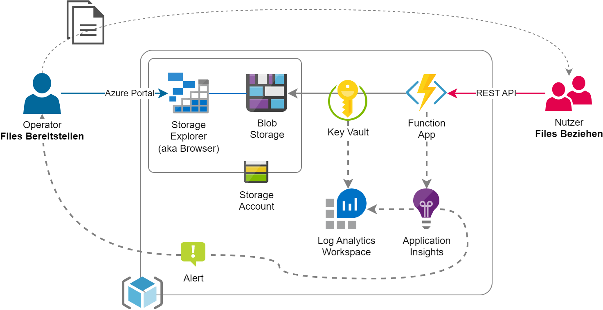

# Hands-on Challenge
Dein Kunde möchte eine REST API zum Anzeigen und Downloaden von manuell bereitgestellten Files anbieten können. Du bist beauftragt, möglichst schnell und einfach einen Proof of Concept zu realisieren.
Je nach deinem individuellen Kenntnisstand kannst du dich für die einfache oder die leicht fortgeschrittene Variante entscheiden. Bei beiden Varianten steht ein Guide sowie alternativ ein komplettes Deployment zur Verfügung.

## Variante Einfach

[Variante wählen](./basic/README.md)

## Variante Fortgeschritten

[Variante wählen](./advanced/README.md)

# Tipps & Tricks

## Global Subscription Filter
Ihr seht die Subscription nicht? Nebst Berechtigungsproblemen könnte der Grund der globale Subscription Filter sein, welcher als Default eingerichtet ist. Insgesamt stiften dieser meist mehr Probleme als Nutzen und wir empfehlen euch diese Konfiguration:

## Sprache
Wenn ihr das Portal zum ersten Mal öffnet, erscheint vielleicht alles in Deutsch. Das empfehlen wir nicht, weil auch die Schlüsselbegriffe (Subscription -> Abonnement usw.) übersetzt werden. So findet ihr auf z.B. StackOverflow kaum etwas und müsst bei Info-Sessions immer alles für euch adaptieren. Trotz Englisch als Anzeigesprache kann man Formatierungen (Währung, Datum/Zeit usw.) schweizerisch darstellen lassen:

# Fragen zur Reflexion

- Wieviel kostet die Implementation pro Monat? Von was ist es abhängig? Wie kann man das kontrollieren (und überwachen)?
- Wie gut skaliert die Implementation? Funktioniert die Anwendung mit 1k Requests pro Stunde? Mit 10k, 100k, ....?
- Wie gut ist die Sicherheit der Lösung? Wie greifen die Services aufeinander zu? Gibt es Incidents wie z.B. Secrets welche im Klartext konfiguriert sind? Gibt es Empfehlungen und, falls ja, wo?
- Wie lange dauern die jeweiligen Requests? Welche Varianz (min/max) gibt es? Wie setzen sich die Durchlaufzeiten zusammen?
- Für welchen Zeitraum können die Analysen (d.h. obenstehend geforderte Statistik) durchgeführt werden? Ist dieser anpassbar, falls ja wie und mit welchen Konsequenzen?